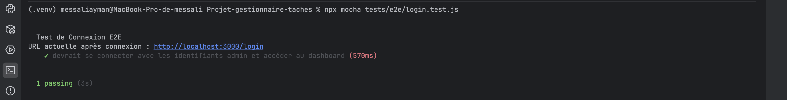
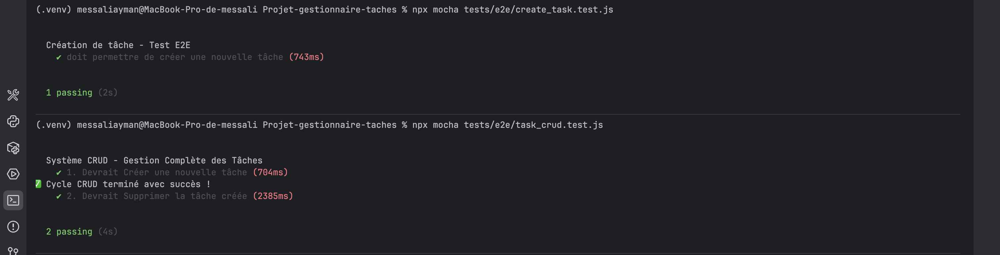
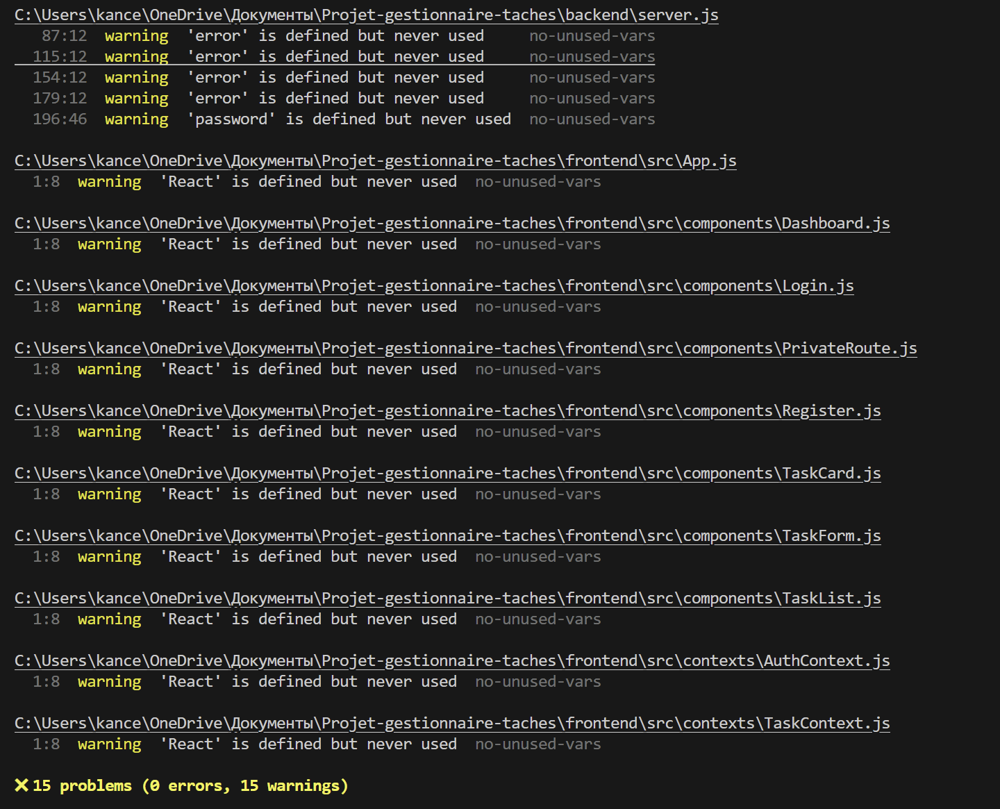
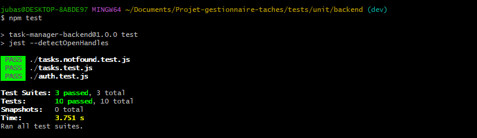

# 🧪 Partie E2E — Travail réalisé

Dans cette partie du projet, **j’ai mis en place des tests automatisés** pour vérifier les fonctionnalités critiques de l’application.

Mon objectif était de :

- automatiser la vérification des fonctionnalités principales
- détecter rapidement les erreurs après une modification du code
- éviter les régressions avant la mise en production

Pour cela, j’ai utilisé **Selenium WebDriver** pour contrôler le navigateur et **Mocha** comme framework de test.

# 1️⃣ Architecture des Tests

J’ai organisé les scripts de tests dans le dossier suivant :

tests/e2e/

Chaque fichier correspond à un scénario utilisateur spécifique.

## `login.test.js`

Dans ce test, **j’ai vérifié le fonctionnement du système d’authentification**.

Ce test simule un utilisateur qui :

1. ouvre la page de connexion
2. saisit ses identifiants
3. valide le formulaire
4. accède à l’application

L’objectif était de vérifier que :

- la connexion fonctionne avec des identifiants valides
- l’utilisateur est correctement redirigé après connexion

## `create_task.test.js`

Dans ce test, **j’ai automatisé la création d’une nouvelle tâche**.

Le script :

1. ouvre la page des tâches
2. remplit le formulaire de création
3. valide le formulaire
4. vérifie que la tâche apparaît dans la liste

Cela permet de confirmer que la communication entre **l’interface et le serveur fonctionne correctement**.

## `task_crud.test.js`

Dans ce fichier, **j’ai testé le cycle complet de gestion d’une tâche**.

Le test vérifie les opérations principales appelées **CRUD** :

- **Create** → créer une tâche
- **Read** → vérifier qu’elle s’affiche
- **Delete** → supprimer la tâche

Ce scénario reproduit l’utilisation réelle de l’application par un utilisateur.

# 2️⃣ Défis Techniques que j’ai rencontrés

Pendant le développement des tests, **j’ai rencontré plusieurs problèmes techniques**.  
J’ai dû analyser ces problèmes et trouver des solutions pour rendre les tests fiables.

## Problème 1 — Incompatibilité avec Chrome

Lorsque j’ai commencé les tests, **le navigateur Chrome ne fonctionnait pas correctement avec la version du driver utilisée**.

Cela provoquait des erreurs lors du lancement du navigateur.

### Solution

J’ai résolu ce problème en **passant à Selenium 4**, qui gère automatiquement les drivers des navigateurs.

Cela permet d’éviter les conflits entre les versions de Chrome et du driver.

## Problème 2 — Chargement asynchrone des pages

Un autre problème était que **les éléments de la page n’étaient pas toujours chargés au moment où le test essayait d’interagir avec eux**.

Cela provoquait des erreurs comme :

Element not found

### Solution

Pour résoudre ce problème, **j’ai utilisé des Explicit Waits**.

Cela permet de dire au test :

> attendre que l’élément soit présent ou cliquable avant de continuer.

## Problème 3 — Interface dynamique

Dans certaines pages, **les identifiants HTML changeaient automatiquement**.

Cela rendait les sélecteurs instables.

### Solution

Pour éviter ce problème, **j’ai utilisé des sélecteurs XPath basés sur le texte visible**.

### 3️⃣ Comment exécuter les tests

Pour lancer les tests sur la machine locale, il faut d’abord vérifier que l’application fonctionne.

Prérequis

Les deux serveurs doivent être démarrés :

serveur Frontend

serveur Backend

Dans le terminal, j’exécute la commande suivante :

npx mocha tests/e2e/*.test.js

Cette commande lance tous les tests E2E présents dans le dossier.

Si tout fonctionne correctement, le terminal affiche :

2 passing

🚀 Importance des tests E2E

Le travail réalisé permet de vérifier automatiquement les fonctionnalités critiques en quelques secondes.

Grâce à ces tests, on peut rapidement confirmer que :

un utilisateur peut se connecter

un utilisateur peut créer une tâche

un utilisateur peut gérer ses tâches

Cela réduit fortement les risques d’erreurs lors des mises à jour de l’application et améliore la qualité globale du logiciel.

**Validation de la connexion :**

**Validation du cycle Création/Suppression :**

**PARTIE ES LINT**

**Problèmes rencontrés**

Lors de la mise en place de l'analyse de code avec ESLint, plusieurs problèmes ont été rencontrés.

Tout d'abord, ESLint signalait que certaines variables comme require, module ou process n'étaient pas définies.
Cela venait du fait que la configuration par défaut ne prenait pas en compte l'environnement Node.js utilisé dans le backend.

Ensuite, des erreurs de parsing apparaissaient dans les fichiers du frontend.
Ces erreurs étaient liées à la présence de JSXutilisé par React, qui n'était pas reconnu par la configuration initiale d’ESLint.

Enfin, après correction de la configuration, ESLint signalait plusieurs variables non utilisées (par exemple React, error ou password).
Ces avertissements ont été corrigés soit en supprimant les variables inutiles, soit en les utilisant dans le code lorsque cela était nécessaire.

Après ajustement de la configuration et correction de certains éléments du code, l’analyse ESLint fonctionne correctement et ne retourne plus d’erreurs bloquantes.

# README — Partie Tests Unitaires Backend (Youcef)

## Présentation

Dans le cadre du projet, je me suis occupé de la partie **tests unitaires backend**.  
Mon objectif était de vérifier le bon fonctionnement des principales fonctionnalités du serveur, notamment l’authentification et la gestion des tâches.

Pour cela, j’ai utilisé :

- **Jest**
- **Supertest**

## Tests réalisés

J’ai créé plusieurs fichiers de tests backend afin de vérifier :

- la connexion avec des identifiants valides ;
- le refus de connexion avec des identifiants invalides ;
- le refus d’accès aux routes protégées sans token ;
- la récupération des tâches ;
- la création d’une tâche ;
- le refus de création d’une tâche sans titre ;
- la modification du statut d’une tâche ;
- la suppression d’une tâche ;
- les cas où une tâche n’existe pas.

Les fichiers utilisés sont :

- `auth.test.js`
- `tasks.test.js`
- `tasks.notfound.test.js`

## Problèmes rencontrés

### 1. `npm test` ne fonctionnait pas au début

Le premier problème que j’ai rencontré est que la commande `npm test` ne trouvait pas les tests automatiquement.

Le problème venait du fait que les fichiers de tests backend étaient placés dans une arborescence précise du projet, et non dans l’emplacement le plus simple à détecter directement par Jest.

### 2. Problème avec le `package-lock.json`

J’ai aussi rencontré un problème lié au `package-lock.json`.  
Après certaines manipulations avec npm, le projet n’était plus exactement dans le bon état, ce qui bloquait certaines commandes ou créait des différences locales.

### 3. Les premiers tests ne couvraient pas assez de cas

Au début, je testais surtout les cas où tout fonctionnait normalement, comme une connexion valide ou la création correcte d’une tâche.

Je me suis ensuite rendu compte qu’il fallait aussi vérifier les cas d’erreur, par exemple :

- mauvais identifiants ;
- absence de token ;
- tâche sans titre ;
- tâche inexistante.

## Solutions apportées

Pour résoudre ces problèmes :

- j’ai adapté la manière de lancer les tests afin qu’ils soient bien pris en compte ;
- j’ai remis le bon `package-lock.json` pour retrouver un environnement stable ;
- j’ai réinstallé les dépendances si nécessaire ;
- j’ai ajouté plusieurs tests supplémentaires pour couvrir aussi les erreurs possibles.

## Ce que cette partie m’a appris

Cette partie m’a permis de mieux comprendre :

- le fonctionnement de Jest ;
- l’utilisation de Supertest sur un backend ;
- l’importance de la configuration des tests ;
- le rôle du `package-lock.json` dans la stabilité du projet ;
- l’intérêt de tester aussi les cas d’erreur, et pas seulement les cas où tout marche.

## Bilan

Au final, j’ai réussi à mettre en place une base de **tests unitaires backend** sur les routes principales du projet.

Cette partie m’a permis de contribuer à la qualité du backend en vérifiant automatiquement plusieurs fonctionnalités importantes, tout en résolvant les principaux problèmes liés au lancement des tests et à l’environnement npm.

